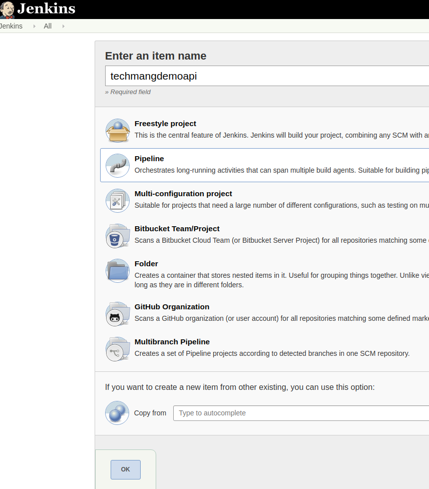
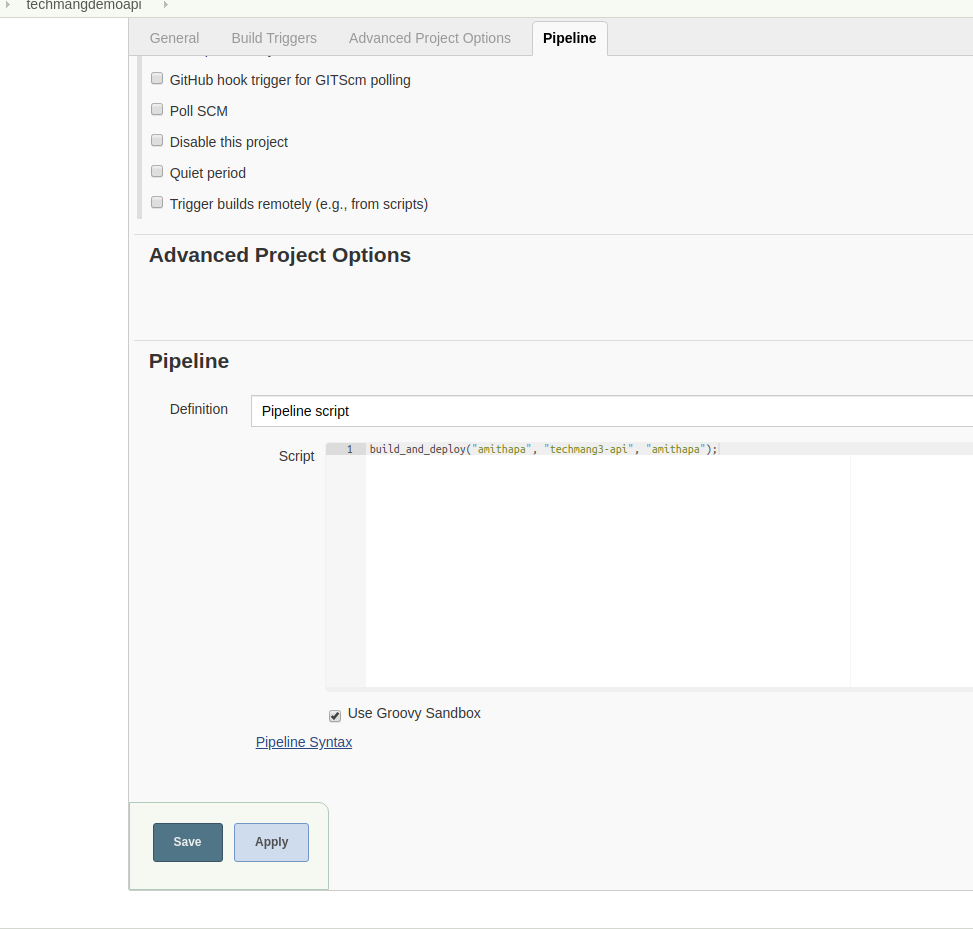

##  Adding an polling for the application for CI/CD into our jenkins


- **We will add a pipeline project for polling.**   
  Click on the following url:
  [http://jenkins.server.local:8080/view/all/newJob](http://jenkins.server.local:8080/view/all/newJob)  
  
  Following window will be loaded:  
  
    
  Select on **Pipeline project** and Cick on **ok**
  
- Under **Pipline tab** tab add the following settings:  

   
  ```bash
      build_and_deploy("git_username", "repository_name", "docker_id");
  ```
  Click on **save**
---
[Back](/scripts/README.md) | [Home](/scripts/README.md)