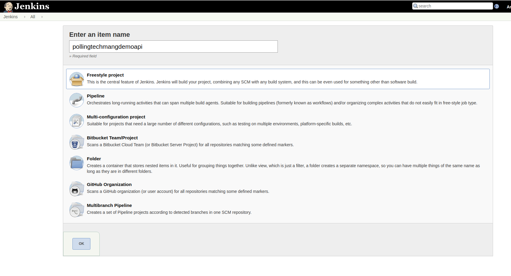
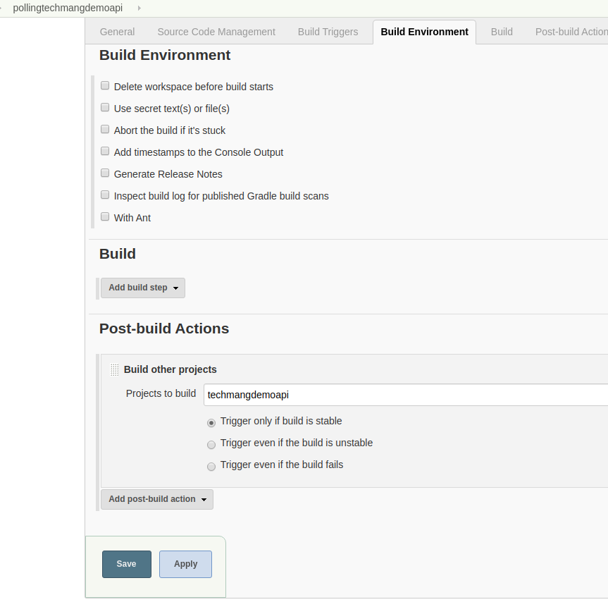

##  Adding an application for CI/CD into our jenkins

- **We will add a freestyle project for polling.**   
  We should be ideally use github webhooks for simplicity of this project we will use scm polling.
  Click on the following url:
  [http://jenkins.server.local:8080/view/all/newJob](http://jenkins.server.local:8080/view/all/newJob)  
  
  Following window will be loaded:  
  
    
  Select on **Freestyle project** and Cick on **ok**
- Under **Source code Management** tab add the following settings:  

   

- Under **Build Triggers** tab add the following settings: 
  
   

- Under **Build Environment** tab add the following settings: 
  
   
  
  Click on save.
---
[Back](/scripts/README.md) | [Home](/scripts/README.md)