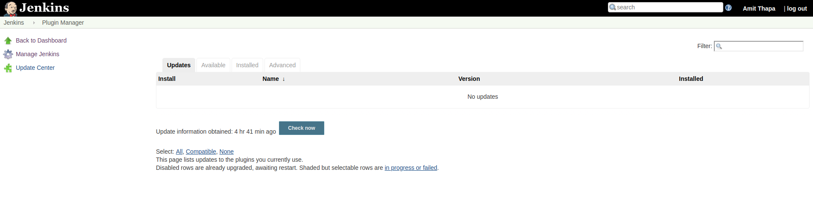
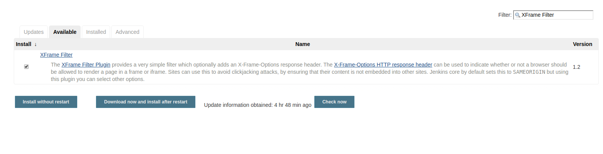

##  Install jenkins Plugins

- Installing jenkins plugins   
  Click on the following url:  
  [http://jenkins.server.local:8080/pluginManager/](http://jenkins.server.local:8080/pluginManager/)
  
- Click on Available and search for the following plugins
  - Blue Ocean
  - XFrame Filter
- As shown in the figure below select Blue Ocean and xFrame Filter and click on **Download now and install after restart**  
    
  You might have to wait untill the installation is completed.
    
---
[Back](/scripts/README.md) | [Home](/scripts/README.md)