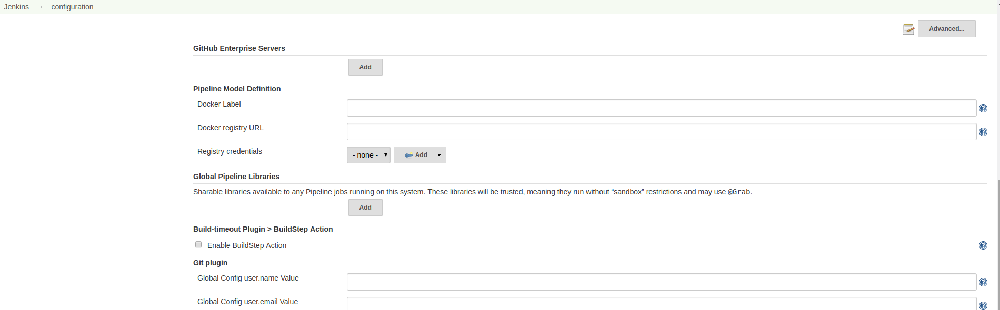
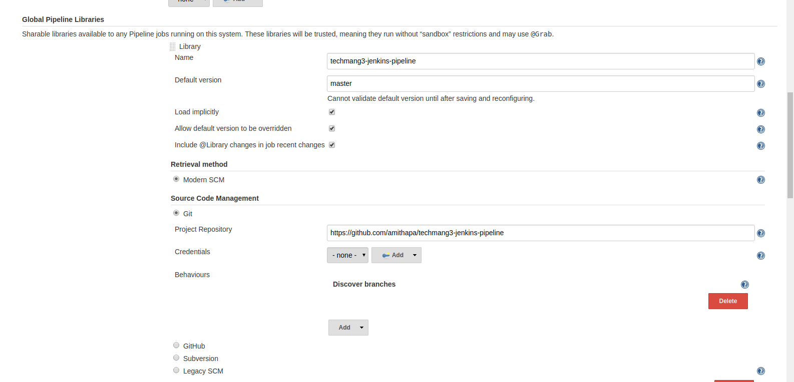

##  Setting up Global pipeline libraries 

This libraries can be used globaly by all the jenkins projects. 

- Lets navigate to the following url to the **configure** section of jenkins
  - Scroll down to the **Global Pipeline Libraries** and click on Add button   
  
     
  - Add the repository which has the source code of your global jenkins pipeline script  
  
    
  Save the configuration.
  
---
[Back](/scripts/README.md) | [Home](/scripts/README.md)