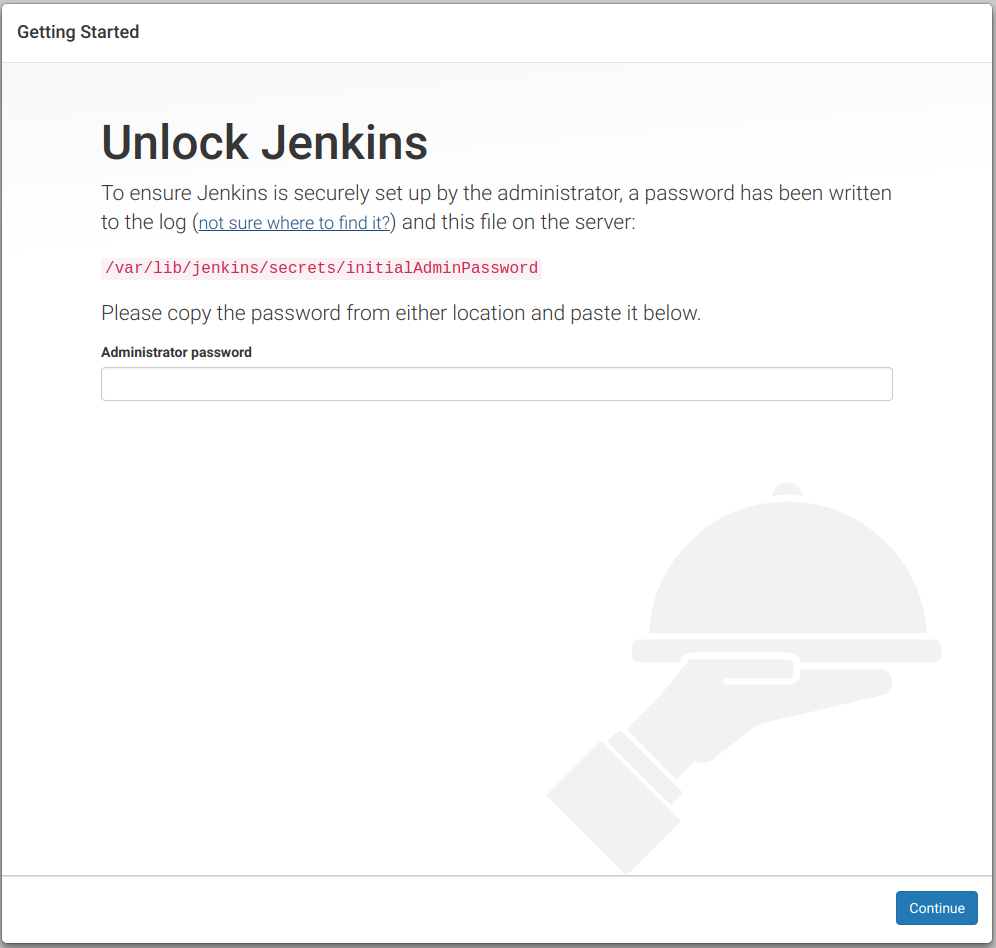
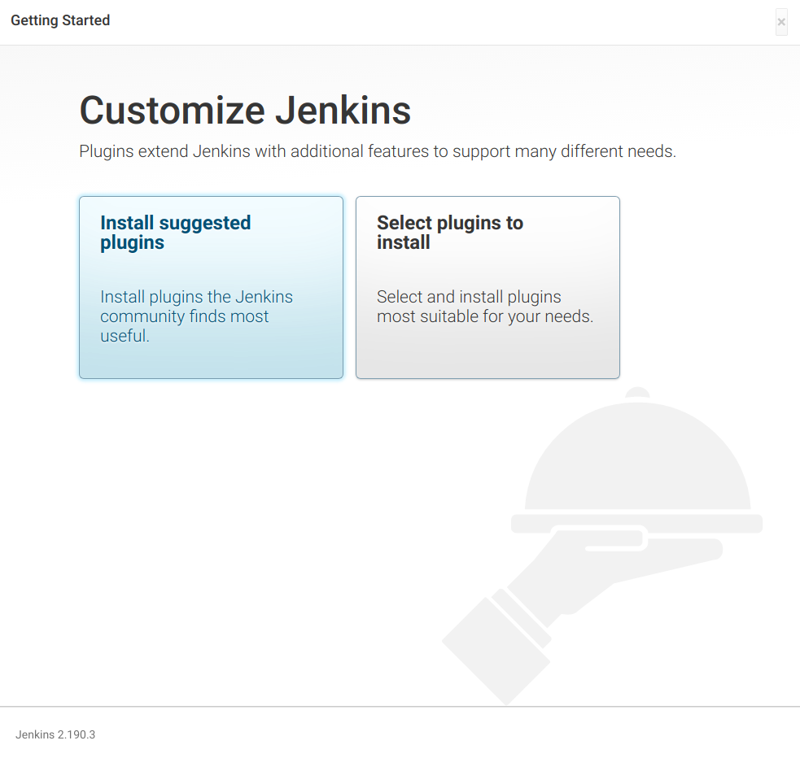
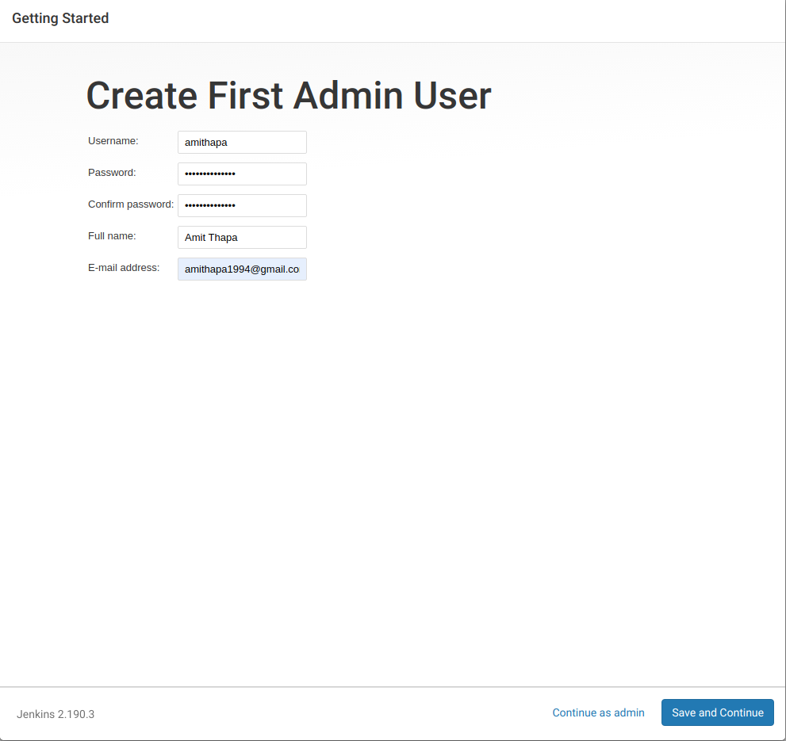
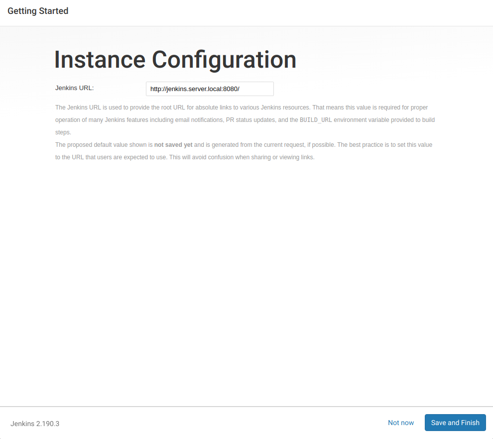
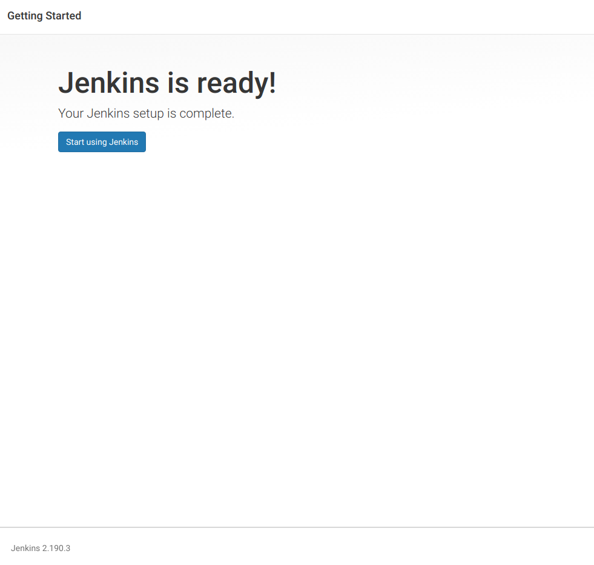

##  Setting up Jenkins server


- **We will setup Jenkins server now.**   
  Click on the following url:
  [http://jenkins.server.local:8080](http://jenkins.server.local:8080)  
    - Following window will be loaded:  
      
  
    - Use the following command to get the token
      ```bash
      sudo lxc exec jenkinsserver -- su  - jenkins -c "cat /var/lib/jenkins/secrets/initialAdminPassword"
      ```
      
      E.g.: We got the token **3892f0484a00409d97724c7731eff228**
      
      Paste the token and click on continue
    - Following window will be loaded:  
        
      Click on install suggested plugins.
    - Fill in the details for the first admin user and click on **save and continue**  
      
    - Click on **Save and Finish**  
      
    - Click on **Start Using Jenkins**  
      
---
[Back](/scripts/README.md) | [Home](/scripts/README.md)